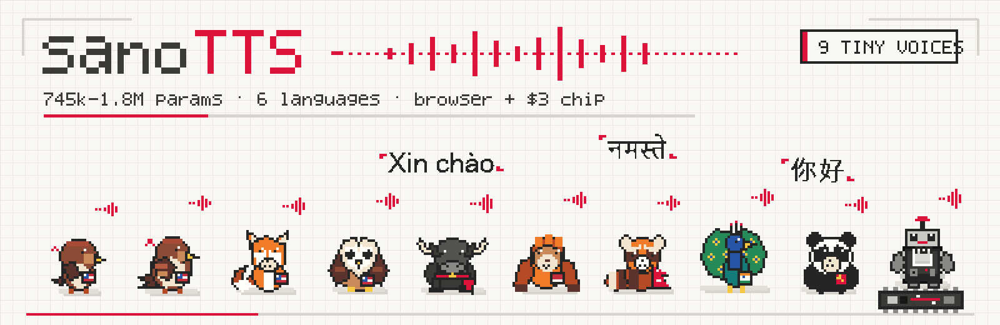
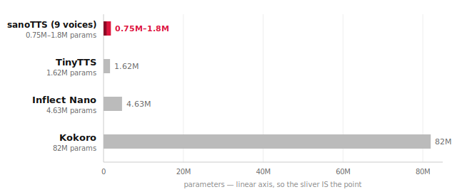
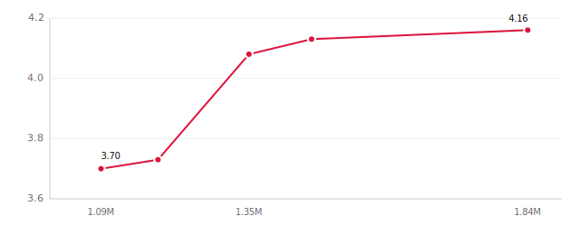

# sanoTTS — a tiny neural voice that runs anywhere

***sano*** (सानो) — Nepali for **"small."** A family of tiny neural text-to-speech
voices — **745k to 1.8M parameters** — that run with **no cloud and no NPU**:
real-time on a ~$3 ESP32-S3 (out a GPIO into an LM386 and a speaker), or live
in the browser via WASM.



- smallest neural TTS family known — **745k to 1.8M parameters**
- runs **real-time** on a **$3 microcontroller** (ESP32-S3)
- runs right in your browser — **WebAssembly**, no server
- under **4 MB** per voice, zero dependencies (espeak-ng phonemizer included)
- **9 voices** across **6 languages** — English, Nepali (नेपाली), Hindi (हिन्दी),
  Vietnamese (Tiếng Việt), Indonesian (Bahasa), Chinese (中文)
- open source, **GPL-3.0**

## Live demo

**[ampixa.github.io/sanoTTS](https://ampixa.github.io/sanoTTS/)** — every voice
synthesizes your text live in the browser. No server, no upload: text goes
through an espeak-ng-in-WASM phonemizer and that voice's own neural stack, all
client-side.

## Install & use

**Python** (CLI + library; voices download on first use):

```bash
pip install sanotts

sanotts say "Hello from a two megabyte voice." --voice amy -o hello.wav
sanotts say "Xin chào!" --voice vi -o xinchao.wav
```

```python
import sanotts
result = sanotts.synthesize("Hello world", voice="amy")   # numpy audio @ 22.05 kHz
```

Voices: `amy`, `amy-1p1m`, `amy-1p8m`, `kristin`, `hfc`, `vi`, `id` — fetched
from the [voices-v1 release](https://github.com/Ampixa/sanoTTS/releases/tag/voices-v1)
into `~/.cache/sanotts/`. Pure numpy inference, no torch, no onnxruntime.

**Arduino / PlatformIO** — the `SanoTTS` library lives in
[`arduino/`](arduino/): add it to the Arduino IDE as a .zip library, or in
`platformio.ini`:

```ini
lib_deps = https://github.com/Ampixa/sanoTTS.git
```

See [`arduino/README.md`](arduino/README.md) for board support (ESP32-S3 ✓),
memory guidance, and flashing the model blobs
([mcu-kristin-745k-q8.tar.gz](https://github.com/Ampixa/sanoTTS/releases/tag/voices-v1)).

**Hugging Face** — the voice packages are mirrored at
[huggingface.co/ampixa/sanoTTS](https://huggingface.co/ampixa/sanoTTS).

**Browser** — nothing to install: [ampixa.github.io/sanoTTS](https://ampixa.github.io/sanoTTS/).

### Deploy on your own site

sanoTTS's browser demo runs entirely client-side — WebAssembly, no server —
so "deploying" it just means hosting a handful of static files. Two ways to
do it:

**Option A — `npm install sanotts-web`** ([on npm](https://www.npmjs.com/package/sanotts-web))

```js
import { SanoTTS, playAudio } from 'sanotts-web';

const tts = await SanoTTS.load({
  assetBase: 'https://your-cdn.example.com/sanotts/',   // where you copied dist/
});
const result = await tts.synthesize('Hello from my own server.', {
  voice: 'amy',
  voiceBase: 'https://your-cdn.example.com/sanotts/',   // where you copied voices/
});
playAudio(result);
```

Copy the package's `dist/` (the wasm runtime) and this repo's `web/voices/`
directory to your own static host, then point `assetBase`/`voiceBase` at it.
Everything else — phonemization, synthesis, playback — happens in the
visitor's browser.

**Option B — no build, no npm**

Copy `web/snt_g2p.js`, `web/snt_g2p.wasm`, `web/snt_g2p.data`,
`web/snt_voice.js`, `web/snt_voice.wasm`, and `web/voices/` from this repo
(or scrape them straight from `ampixa.github.io/sanoTTS`) onto your static
host, and load them the same way `web/index.html` does:

```html
<script src="/sanotts/snt_g2p.js"></script>
<script src="/sanotts/snt_voice.js"></script>
<script type="module">
  const [G2P, Voice] = await Promise.all([SaanoG2P(), SaanoVoice()]);
  G2P._snt_g2p_init();
  // ...set voice, phonemize, synthesize — see web/index.html for the full sequence.
</script>
```

**Sizes to plan around:**

- wasm runtime: ~700 KB total gzipped over the wire (espeak-ng G2P
  ships ~2.5 MB uncompressed including its phoneme-table `.data`, ~700 KB
  gzipped; the acoustic/decoder wasm adds another ~40 KB)
- per-voice weights: 4–7 MB, fp32 (`front_f32.bin` + `dec_f32.bin`), fetched
  lazily on first use of that voice, not bundled with the runtime — int8
  quantized voices (~4x smaller) are planned but not yet shipped

**CSP note:** the wasm runtime needs `'wasm-unsafe-eval'` (or
`'unsafe-eval'` on older browsers) in your `script-src` Content-Security-Policy,
for `WebAssembly.instantiate`/`instantiateStreaming`. Nothing else needs
relaxing — the runtime never `eval()`s JavaScript. Most default/modern CSPs
(including having no explicit `script-src`) already allow this.

## How it stacks up

Open small-scale TTS on an honest gate — a diverse 24-sentence set scored with the
**same** no-reference suite (SCOREQ / UTMOS are naturalness predictors, DNSMOS-SIG
is signal quality; higher is better). Parameter counts are inference-time and
exclude the shared external G2P.



Kokoro is 45x larger than our largest voice, and 110x larger than our smallest.
Shipped-file sizes: sanoTTS amy 2.8 MB fp16 and TinyTTS 3.5 MB fp16, both
verified from the released files; Kokoro's ~330 MB fp32 is its widely cited
public figure.

| System | Params | SCOREQ | UTMOS | DNS-SIG |
| --- | ---: | :---: | :---: | :---: |
| **sanoTTS (amy)** | **1.46 M** | **4.13** | **4.10** | 3.61 |
| TinyTTS | 1.62 M | 3.94 | 3.65 | **3.62** |
| Inflect Nano | 4.63 M | 3.81 | 3.65 | 3.58 |
| Kitten TTS nano | 15 M | 3.02 | 3.58 | 3.43 |
| _reference (~15 M)_ | _~15 M_ | _4.71_ | _4.47_ | _3.65_ |
| _Kokoro_ | _82 M_ | _4.89_ | _4.52_ | _3.69_ |

sanoTTS is the **smallest** model here and the **best on naturalness (SCOREQ and
UTMOS) among everything up to 15M params** — beating TinyTTS while being smaller.
On DNSMOS-SIG, TinyTTS edges us by 0.01 — no single metric tells the whole story.
It's the only one that runs a full neural stack on a $3 MCU. Parameter count
isn't destiny at this scale: Kitten TTS at 10x the size scores a full SCOREQ
point lower. The frontier only pulls ahead at ~15M-class models and Kokoro (82M,
60x larger) — a gap we don't claim to close. Reproduce it with
`tools/eval_mos_all.py` + `tools/eval_scorecard.py`.



Same voice (amy), same duration/acoustic recipe — only decoder size changes.
Quality lives in the decoder: doubling it from 1.09M to 1.84M params moves
SCOREQ from 3.70 to 4.16.

## The voices

| Language | Voice | Params | SCOREQ |
| --- | --- | ---: | :---: |
| English 🇺🇸 | amy | 1.46 M | 4.13 |
| | kristin | 1.40 M | 4.09 |
| | hfc | 1.83 M | 3.94 |
| | amy-small | 1.08 M | 3.70 |
| | robot (on-device, int8) | 745 k | — |
| Nepali नेपाली | Nepali | 1.47 M | — |
| Hindi हिन्दी | Hindi | 1.50 M | — |
| Vietnamese Tiếng Việt | Vietnamese | 1.46 M | — |
| Indonesian Bahasa | Indonesian | 1.46 M | — |
| Chinese 中文 | Chinese | 1.50 M | — |

The "robot" row is the same 745k-parameter model that runs on the ESP32-S3 —
bit-exact with the chip's own output. SCOREQ is only reported for the English
voices, which share a common eval set; the other languages haven't been scored
against a comparable reference yet.

## How it works


espeak-ng provides phoneme IDs; a duration model predicts timing; an acoustic
model predicts generator latents; a decoder renders 22 kHz audio.
The web voices (amy, kristin, hfc, and the other languages) use a compact
time-domain decoder running in fp32 WASM; the 745k on-device model instead uses
a quantized int8 iSTFT decoder, sized to fit and run in real time on the
ESP32-S3.

## Train your own voice

The end-to-end recipe is [in the docs](docs/distillation-recipe.md):
build a probe pack → train the duration, acoustic-latent, and decoder models →
joint finetune → export int8. New-language porting is
[`docs/roota-language-porting-recipe.md`](docs/roota-language-porting-recipe.md).

```bash
pip install -e .
# then follow the training recipe in docs/ to make a new voice
```

## Deploy

- **ESP32-S3 talking device** — a standalone WiFi dashboard: type text, the board
  phonemizes (on-chip espeak-ng) and speaks. See
  [`mcu/ports/esp32s3/`](mcu/ports/esp32s3/).
- **Browser** — the full stack in WASM, no server. **[▶ Hear and synthesize all 9
  voices live](https://ampixa.github.io/sanoTTS/)** (GitHub Pages); source in
  [`web/`](web/).
- **Other MCUs** — which chips can run it and how well:
  [`docs/mcu-classes-and-porting.md`](docs/mcu-classes-and-porting.md).

## Verify your result

The eval loop measures what actually matters — intelligibility (Whisper WER),
phoneme-class fidelity, and G2P parity — not just a gameable MOS score:
`tools/eval_scorecard.py`, `tools/eval_phoneme_class_fidelity.py`,
`tools/eval_g2p_parity.py`.

## Layout

[`docs/repository-layout.md`](docs/repository-layout.md). In short: `src/saanotts/`
(package), `tools/` (pipeline + eval commands), `mcu/` (portable C runtime + device
ports), `web/` (browser demo), `configs/` + `data/textsets/` (contracts).

## License

GPLv3 — see [`LICENSE`](LICENSE). The pipeline builds on GPLv3 components
(notably [espeak-ng](https://github.com/espeak-ng/espeak-ng) for G2P), so the
project as a whole is GPLv3.

Copyright (C) 2026 Ampixa.
