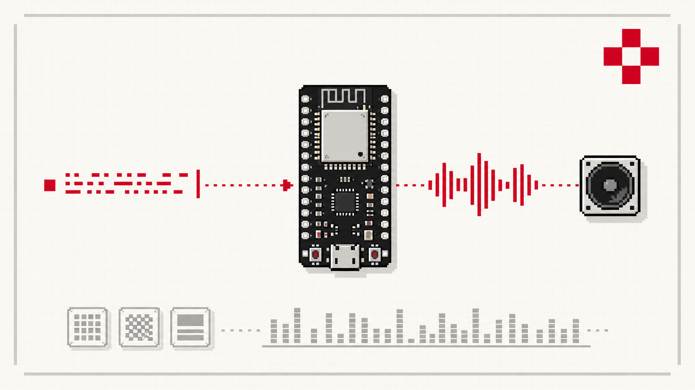

# sanoTTS — a tiny neural voice that runs anywhere

***sano*** (सानो) — Nepali for **"small."** A small neural TTS: distill a Piper/VITS
teacher voice into a **~1.4M-parameter** model that runs with **no cloud and no
NPU** — real-time on a ~$3 ESP32-S3 (out a GPIO into an LM386 and a speaker), or in
the browser via WASM.



It's a full neural stack — duration → acoustic → iSTFT decoder — distilled from the
teacher, not a lookup of pre-rendered clips. The on-device variant shrinks to
**~745k int8 params**, runs **faster than real time on the ESP32-S3**, and stays
intelligible on-chip (Whisper WER ~18% with on-chip espeak G2P).

## How it stacks up

Open small-scale TTS on an honest gate — a diverse 24-sentence set scored with the
**same** no-reference suite (SCOREQ / UTMOS are naturalness predictors, DNSMOS-SIG
is signal quality; higher is better). Parameter counts are inference-time and
exclude the shared external G2P.

| System | Params | SCOREQ | UTMOS | DNS-SIG |
| --- | ---: | :---: | :---: | :---: |
| **sanoTTS (amy)** | **1.46 M** | **4.13** | **4.10** | 3.61 |
| TinyTTS | 1.62 M | 3.94 | 3.65 | **3.62** |
| Inflect Nano | 4.63 M | 3.81 | 3.65 | 3.58 |
| Kitten TTS nano | 15 M | 3.02 | 3.58 | 3.43 |
| _Piper (teacher)_ | _~15 M_ | _4.71_ | _4.47_ | _3.65_ |
| _Kokoro_ | _82 M_ | _4.89_ | _4.52_ | _3.69_ |

sanoTTS is the **smallest** model here and the **best on naturalness (SCOREQ and
UTMOS) among everything up to 15M params** — beating TinyTTS while being smaller,
and effectively tying its signal cleanliness (DNS-SIG within noise). It's the only
one that runs a full neural stack on a $3 MCU. Parameter count isn't destiny at
this scale: Kitten TTS at 10× the size scores a full SCOREQ point lower. The
frontier only pulls ahead at the teacher (~15M) and Kokoro (82M, 60× larger) — a
gap we don't claim to close. Reproduce it with `tools/eval_mos_all.py` +
`tools/eval_scorecard.py`.

## How it works


Piper provides phoneme IDs; a duration student predicts timing; an acoustic student
predicts the generator latents; a compact decoder student renders 22 kHz audio via
an iSTFT head. All three are distilled from the teacher and quantized to int8.

## Distill your own voice

The end-to-end recipe is [`docs/distillation-recipe.md`](docs/distillation-recipe.md):
build a probe pack from a Piper teacher → train the duration, acoustic-latent, and
decoder students → joint finetune → export int8. New-language porting is
[`docs/roota-language-porting-recipe.md`](docs/roota-language-porting-recipe.md).

```bash
pip install -e .
# then follow docs/distillation-recipe.md against any en_US Piper voice
```

## Deploy

- **ESP32-S3 talking device** — a standalone WiFi dashboard: type text, the board
  phonemizes (on-chip espeak-ng) and speaks. See
  [`mcu/ports/esp32s3/`](mcu/ports/esp32s3/).
- **Browser** — the full stack in WASM, no server. **[▶ Hear all four voices and
  run it live](https://ampixa.github.io/sanoTTS/)** (GitHub Pages); source in
  [`web/`](web/).
- **Other MCUs** — which chips can run it and how well:
  [`docs/mcu-classes-and-porting.md`](docs/mcu-classes-and-porting.md).

## Verify your result

The eval loop measures what actually matters — intelligibility (Whisper WER),
phoneme-class fidelity, and G2P parity — not just a gameable MOS score:
`tools/eval_scorecard.py`, `tools/eval_phoneme_class_fidelity.py`,
`tools/eval_g2p_parity.py`.

## Layout

[`docs/repository-layout.md`](docs/repository-layout.md). In short: `src/saanotts/`
(package), `tools/` (pipeline + eval commands), `mcu/` (portable C runtime + device
ports), `web/` (browser demo), `configs/` + `data/textsets/` (contracts).

## License

GPLv3 — see [`LICENSE`](LICENSE). The distillation + G2P path builds on
[piper](https://github.com/OHF-Voice/piper1-gpl) and
[espeak-ng](https://github.com/espeak-ng/espeak-ng), both GPLv3, so the project as a
whole is GPLv3.

Copyright (C) 2026 Ampixa.
